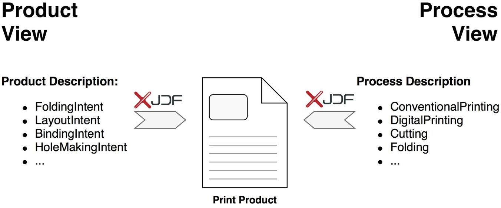

# Essentials
The Exchange Job Definition Format (XJDF) is designed to be a pure data interchange format. XJDF Documents are generated during application runtime to communicate with applications and devices. Each XJDF Document contains dedicated information optimized exclusively for the recipient. 

Technically, XJDF specifies two views on print that are related but not identical - the product view and the process view. The product view is the process of independent product description and describes the final product from the perspective of the print buyer. "The customer or product designer will typically describe the desired final product without knowledge of the manufacturing process." ([*XJDF*, 2024, p. 14](references.md#ref2)) The product description includes, for instance, the size of the desired product, its paper quality, and the folding details if required. The product description is unconcerned with production details, such as the production size of the sheet on which the product is later printed or how the product is positioned on that sheet. All process-specific information is defined in the process view of the XJDF Document. The process view might describe in a very accurate way how each step in the production workflow process has to be accomplished, on which device, and at what time. The following figure illustrates both perspectives specified in an XJDF Document:



The product view is based on Product elements containing multiple Intent elements, such as FoldingIntent, LayoutIntent, BindingIntent, etc. Each Intent element is a container for a specific type of information. FoldingIntent contains, for example, all folding details of the desired product. The XJDF Specification provides individual intent types for a wide range of print products. In addition to the product description, XJDF defines the process steps executed in a print production line to manufacture the final product. In XJDF, process steps are called processes. A production workflow is a concatenation of processes. Each process defined in the XJDF Specification is "assumed to be executed by a single-purpose device" ([*XJDF*, 2024, p. 64](references.md#ref2)). Examples of processes are ConventionalPrinting, DigitalPrinting, Cutting, Folding, etc. The XJDF Specification comes with a broad amount of individual processes. Each process is defined by its unique name, description, and input and output resources. Chapter 5, “Processes” of the XJDF Specification ([2024, pp. 63 ff.](references.md#ref2)), specifies a complete list of all processes. 

The two different views of XJDF enable users to write a pure product description without any production knowledge or to define detailed instructions for a production device. A combination of both is also valid. This makes the data format highly adaptable to many situations and environments. 

## Gray Boxes
Gray Box is a commonly used term in XJDF. The term has been taken over from JDF 1.x and describes something between a Black Box and a White Box. By definition, a Black Box is a device or a system where only the input and output parameters (interfaces) are known. In contrast, a White Box describes a device or a system in which the internals are also known. The term Gray Box describes something in between.
As XJDF enabled devices and applications may not only allow for the definition of input and output but for some additional internal configurations as well, devices and applications are conceptually Gray Boxes. Although most of the XJDF integration is Black Box integration, XJDF does not differentiate. From the perspective of XJDF, each system being integrated is a Gray Box, and the corresponding XJDF document describes it.

Even the simplest product description document for job submission describes a Gray Box. XJDF Documents containing a pure product description are primarily used in Web-To-Print environments, for example, to link a printing house with a Webshop, a public print broker platform, or even a customer’s ERP system with an MIS system for the purpose of automating the customer’s supply chain of print products. The following is an XJDF stub of a product description Gray Box:

```xml
<XJDF JobID="JOB-42" Types="Product"
        xmlns="http://www.CIP4.org/JDFSchema_2_0">
    [...]
</XJDF>
```